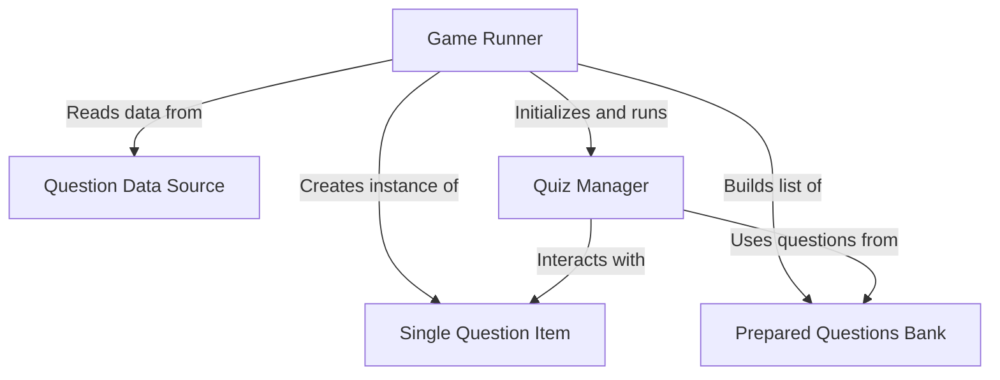

# 🧠 Quiz Game Project

A simple console-based quiz game built using Python. This interactive game asks the user True/False questions and keeps track of their score.

---

## 📌 Overview

This project is a simple *True/False quiz game*.
It reads raw quiz data from a **data source**, turns each question into a structured *quiz item*, and organizes them into a **question bank**.
A **quiz manager** then guides the player through the questions, checks answers, and tracks the score, all orchestrated by a **game runner** that sets up the game and runs the main loop.


## Visual Overview



---

## 🔍 Features

- Interactive command-line interface
- Score tracking
- Instant feedback after each question
- Modular code structure using classes:
  - `Question`: Models a single quiz question
  - `QuizBrain`: Manages the quiz flow and scoring
  - `data.py`: Contains the list of quiz questions and answers

---

## 📁 File Structure

| File            | Description |
|-----------------|-------------|
| `main.py`       | Entry point of the application. Runs the quiz loop. |
| `quiz_brain.py` | Contains the `QuizBrain` class that manages quiz logic. |
| `question_model.py` | Defines the `Question` class to store question-answer pairs. |
| `data.py`       | Stores the quiz questions and answers in a list of dictionaries. |

---

## ▶️ How to Run

1. Make sure you have Python installed (`3.x` recommended).
2. Open your terminal or command prompt.
3. Navigate to the directory containing the files:

   ```bash
   cd path/to/quiz-game-start
4. Run the file
   ```
   python main.py

## For More Questions Use the API:
 Website: https://opentdb.com/
