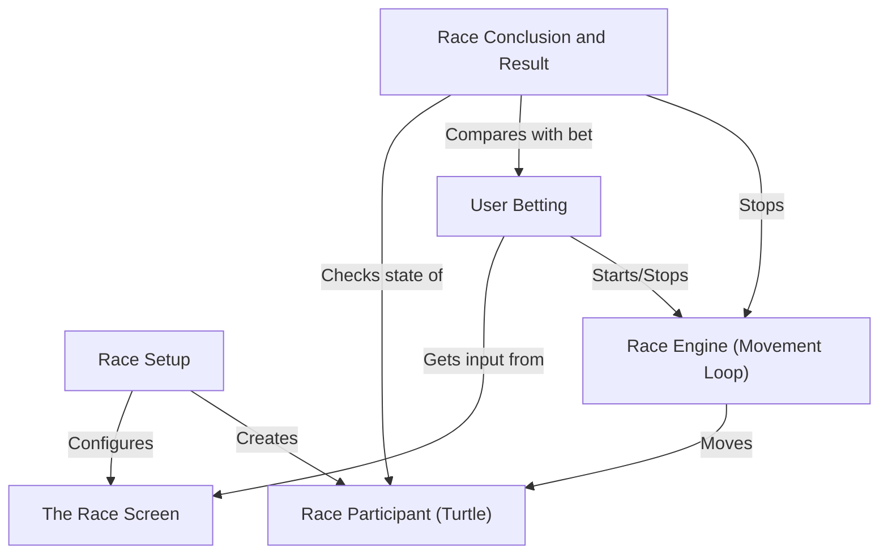
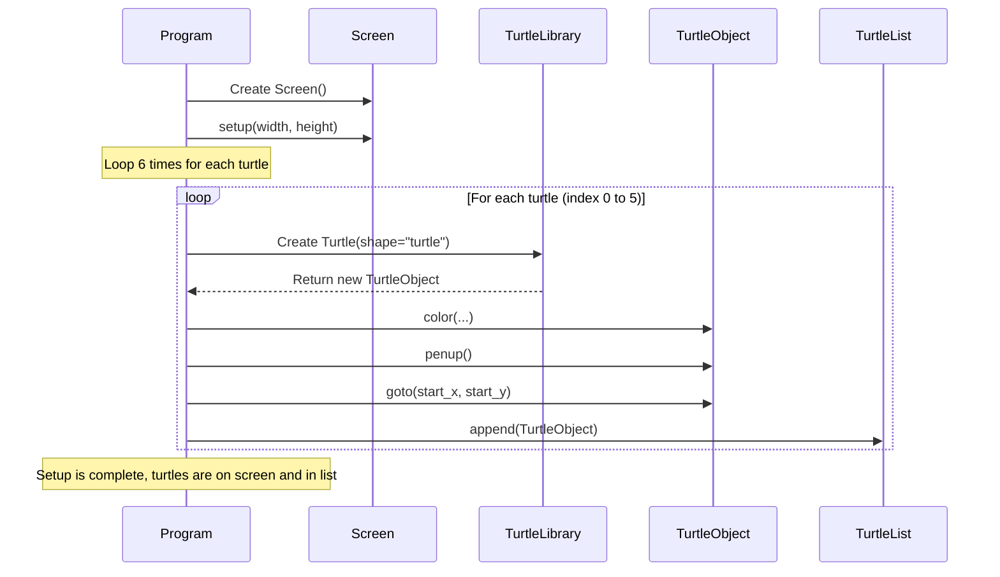
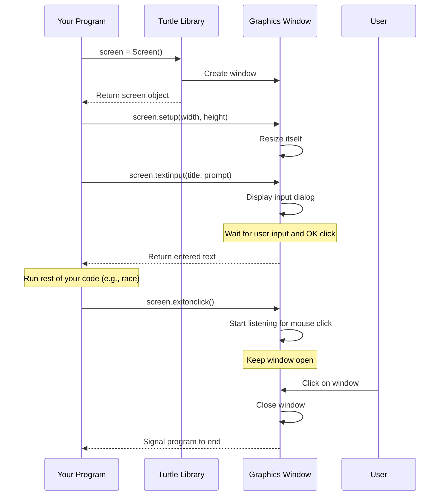
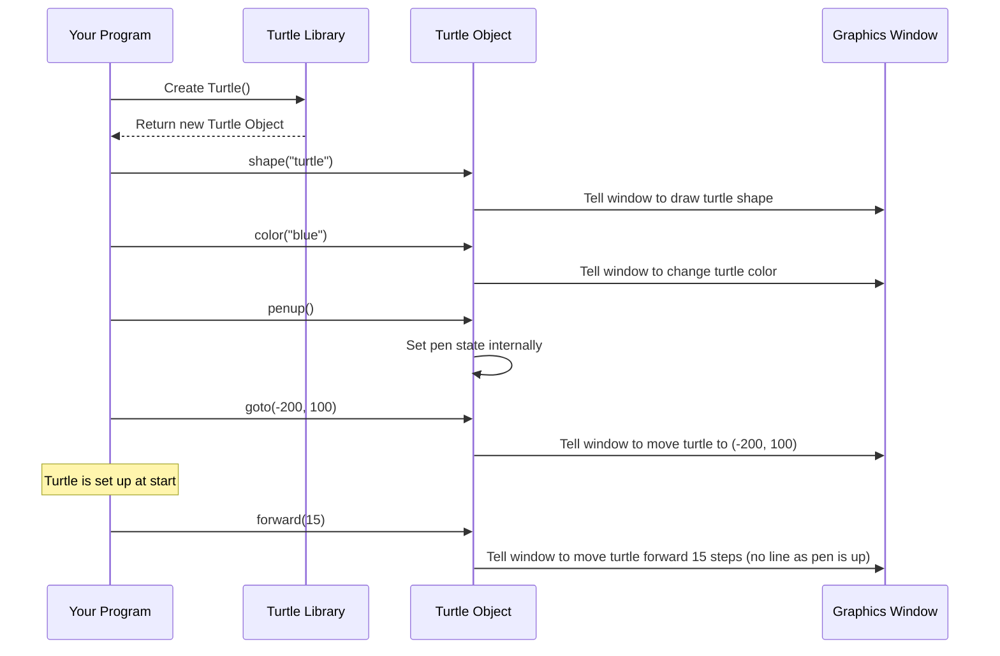
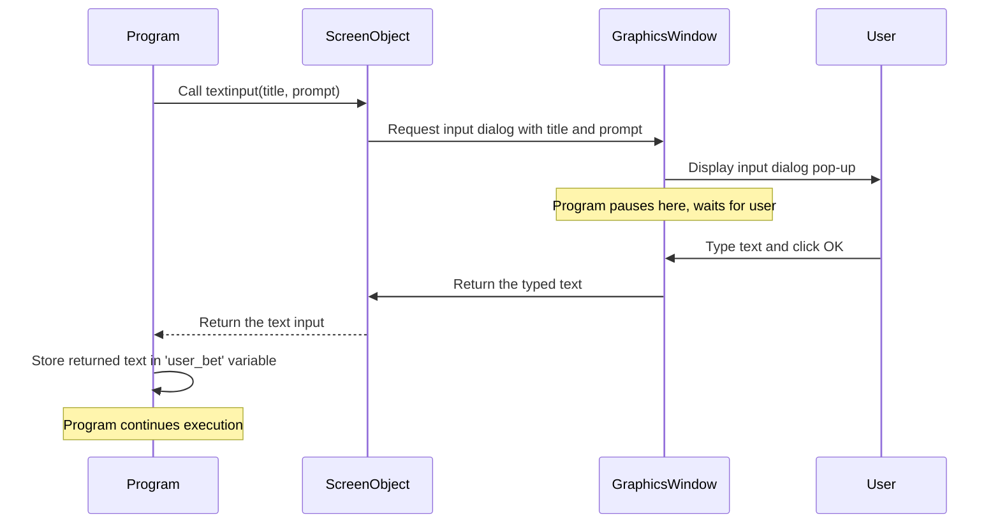
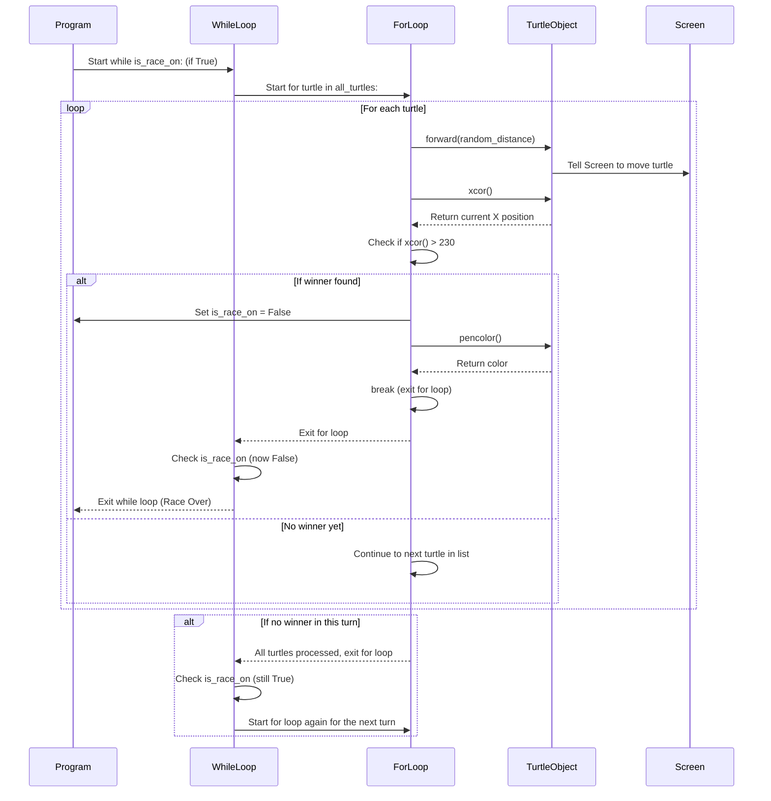
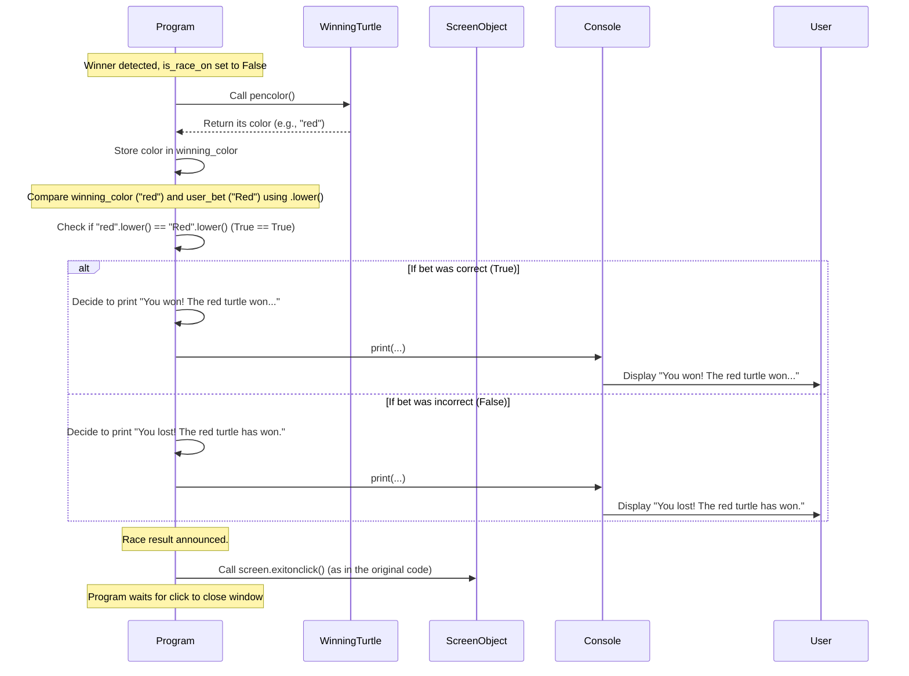

## Turtle Race

This project simulates a *simple turtle race* on a screen.
It **sets up** multiple turtles with different colors,
**asks the user** to bet on which color will win,
then **runs the race** by moving each turtle forward randomly.
Finally, it **announces the winner** and whether the user's bet was correct.


## Visual Overview



Race Setup

Welcome to the start of our journey building a fun turtle race game with Python!

Imagine you're getting ready for a race. What's the very first thing you need to do before anyone even starts running? You need to set everything up! You need a track, the runners, and they all need to be in the right place at the starting line.

That's exactly what "Race Setup" is all about in our game! It's like preparing the starting grid before the turtles zoom off.

### Why is Race Setup Important?

Think about it: if you don't set up the race properly, the turtles won't know where to start, what color they are, or even if they should participate!

Race Setup helps us:

1.  Get the **screen** ready (like preparing the race track).
2.  Create the **participants** (our turtles!).
3.  Make each participant **unique** (by giving them a color).
4.  Place them correctly at the **starting line**.
5.  Keep track of **all** the participants easily.

Let's see how we do this in our Python code.

### Getting the Screen Ready (Just a Peek!)

First, we need a place for our turtles to run. We use the `turtle` library for this.

```python
from turtle import * # Import everything from the turtle library

screen = Screen() # Create the screen object
screen.setup(width=500, height=400) # Set the size of the screen

# ... more setup code will go here ...
```

This bit gets our drawing area ready. We'll talk a lot more about the screen itself in the next chapter, [The Race Screen](02_the_race_screen_.md), but for now, just know that these lines give us the window where our race will happen.

### Preparing the Participants (Our Turtles!)

Now for the stars of the show: the turtles! We need several turtles, not just one. For our race, we'll have six turtles.

We need to decide their colors and where they will start on the screen.

```python
colors = ['red', 'blue', 'green', 'orange', 'black', 'cyan'] # A list of colors
y_position = [70, 40, 10, -20, -50, -80] # A list of starting vertical positions

# We also need a way to keep track of ALL our turtles
all_turtles = []
```

Here, we've created two lists: `colors` holds the names of the colors we'll use, and `y_position` holds the vertical (up and down) starting spot for each turtle. The `all_turtles` list is empty right now, but we'll fill it up with our turtle friends soon!

### Creating, Coloring, and Positioning Turtles

Now comes the fun part: actually creating the turtles and putting them at the start! We do this using a loop. A loop lets us repeat an action multiple times – perfect for creating six turtles without writing the same code six times.

We'll go through each position and color we planned and create a turtle for it.

```python
# ... (previous code for screen, colors, positions, all_turtles) ...

for turtle_index in range(6): # This loop will run 6 times (for index 0 to 5)
    # Inside the loop, we create ONE turtle at a time:
    new_turtle = Turtle(shape="turtle") # Create a new turtle shape
    new_turtle.color(colors[turtle_index]) # Set its color from the list
    new_turtle.penup() # Lift the pen so it doesn't draw when moving to start
    new_turtle.goto(-230, y_position[turtle_index]) # Move it to its start position

    # After setting it up, add this turtle to our list:
    all_turtles.append(new_turtle)

# Now the all_turtles list has all 6 turtles, ready!
```

Let's break down what happens inside this loop:

1.  `for turtle_index in range(6):` This line sets up the loop. `range(6)` means it will give us numbers 0, 1, 2, 3, 4, and 5. `turtle_index` will take on each of these numbers in turn.
2.  `new_turtle = Turtle(shape="turtle")`: We create a new `Turtle` object. This is like hiring a new runner for our race. We tell it to look like a `"turtle"`. We'll learn more about the `Turtle` object in [Race Participant (Turtle)](03_race_participant__turtle__.md).
3.  `new_turtle.color(colors[turtle_index])`: We use the `turtle_index` (like 0, then 1, etc.) to pick a color from our `colors` list. The first turtle gets `colors[0]` which is 'red', the second gets `colors[1]` which is 'blue', and so on. This gives each turtle a unique color.
4.  `new_turtle.penup()`: Turtles normally draw a line when they move. We don't want lines drawn as they move to the starting line, so `penup()` lifts their "pen".
5.  `new_turtle.goto(-230, y_position[turtle_index])`: This moves the turtle to its starting position. The `-230` is the horizontal (left/right) position – it's towards the left edge of our 500-width screen. We use the `turtle_index` to pick a vertical (`y`) position from the `y_position` list, ensuring each turtle starts in a different "lane".
6.  `all_turtles.append(new_turtle)`: After setting up a turtle, we add it to our `all_turtles` list. This way, we have a single list containing *all* the turtles participating in the race. This makes it easy to manage them later.

### What Happens Inside (A Peek Under the Hood)

When you run this setup code, Python works with the `turtle` library to get everything ready.



In this simple flow:

*   Your `Program` first tells the `Screen` to get ready.
*   Then, inside the loop, for each turtle needed:
    *   It asks the `TurtleLibrary` to create a new `Turtle` object.
    *   It tells that newly created `TurtleObject` what color to be, to lift its pen, and where to move.
    *   Finally, it adds this fully set-up `TurtleObject` to the `TurtleList` (`all_turtles`).

After the loop finishes, the `all_turtles` list is populated, and you'll see all six colored turtles lined up at the left side of your screen, ready for action!

### Putting it Together (The Setup Code)

Here is the core part of the race setup code from our project file (`Turtle_GUI/turtle_race/main.py`):

```python
# --- Turtle_GUI/turtle_race/main.py ---
# (Assuming imports and screen setup are done above)

# Data for our turtles
colors = ['red', 'blue', 'green', 'orange', 'black', 'cyan']
y_position = [70, 40, 10, -20, -50, -80]

# A list to hold all our turtle friends
all_turtles = []

# Loop to create and set up each turtle
for turtle_index in range(6):
    new_turtle = Turtle(shape="turtle") # Create the turtle
    new_turtle.color(colors[turtle_index]) # Set its color
    new_turtle.penup() # Lift pen for setup move
    new_turtle.goto(-230, y_position[turtle_index]) # Move to start position
    all_turtles.append(new_turtle) # Add to our list

# Now, all_turtles contains 6 turtles, ready for the race!
```

This block of code precisely handles the "Race Setup" phase: it defines the turtle properties (colors, starting `y` positions), prepares an empty list, and then loops to create each turtle, assign its properties, move it to the start, and collect it in the `all_turtles` list.

### Conclusion

In this chapter, we learned how to perform the crucial "Race Setup". We saw how to prepare the ground (the screen), gather our participants (create `Turtle` objects), make them distinct (assign colors), place them at the starting line, and organize them into a list (`all_turtles`) so we can easily manage them during the race.

With our race track ready and our turtles lined up, we're all set for the next steps!

In the next chapter, we'll take a closer look at the race screen itself and understand more about how it works.


___
Chapter 2: The Race Screen

Welcome back! In [Chapter 1: Race Setup], we started preparing our exciting turtle race. We set up the initial lines of code to get the drawing area ready and created our turtle participants, lining them up at the start.

Now, let's take a closer look at that drawing area itself. It's like the **stadium** or the **race track** where all the action happens! In the `turtle` library, we call this the **Screen**.

### What is "The Race Screen"?

Think of the screen as the main window that pops up when you run your turtle program. It's the stage where our turtles perform. It's not just a static picture; it's interactive! It allows us to:

1.  Define the **size** of our race track.
2.  **Display** everything we draw with our turtles.
3.  Get **input** from the person running the program (that's you!).
4.  Most importantly, it keeps the **window open** so you can see the race finish!

Without the screen, our turtles would have nowhere to run, and their movements would happen invisibly behind the scenes.

### Getting the Screen Ready

As you saw in the last chapter, the very first step related to the screen is creating it.

```python
from turtle import Screen # Import just the Screen part

screen = Screen() # Create the screen object
```

This creates an object named `screen`. We use this `screen` object to control the window and its properties. It's like getting the physical stadium structure built.

### Setting the Size of the Track

Every race track has boundaries. In our turtle race, we set the size of the window using the `setup()` method of the `screen` object.

```python
# ... (assuming screen is created) ...
screen.setup(width=500, height=400) # Set the size of the screen
```

Here, `width=500` means the window will be 500 pixels wide, and `height=400` means it will be 400 pixels tall. You can change these numbers to make your race track bigger or smaller! The turtles starting positions we set up in Chapter 1 (`-230` for x, and different `y` values) are based on this 500x400 size. The center of the screen is (0,0). The far left is roughly -250, the far right is roughly 250, the top is roughly 200, and the bottom is roughly -200.

**Code Snippet:**

```python
from turtle import Screen

screen = Screen()
screen.setup(width=500, height=400)

# When you run this, a window will appear!
# It will be 500 pixels wide and 400 pixels tall.
# It will close immediately unless we tell it to stay open...
```

### Asking for User Input (The Bet!)

Before the race starts, we might want to ask the user who they think will win. The screen can help us do this using the `textinput()` method. This is like a betting booth at the stadium!

```python
# ... (assuming screen is created and set up) ...
user_bet = screen.textinput(title="Make Your Bet", prompt="Which turtle will win the race? Enter a color: ")

# Whatever the user types will be stored in the 'user_bet' variable.
```

Let's look at the parts:

*   `screen.textinput()`: This calls the method on our `screen` object.
*   `title="Make Your Bet"`: This is the text that appears at the top of the small pop-up window.
*   `prompt="Which turtle will win the race? Enter a color: "`: This is the message that tells the user what to type in the box.

When this line of code runs, your program will pause, a small window will pop up asking the question, and it will wait until you type something and click "OK". Whatever you typed is then returned and stored in the `user_bet` variable.

**Code Snippet:**

```python
from turtle import Screen

screen = Screen()
screen.setup(width=500, height=400)

user_bet = screen.textinput(title="Betting Time!", prompt="Type a color (red, blue, etc.): ")
print(f"You bet on: {user_bet}") # This will print the color you typed

# The window still closes immediately...
```

### Keeping the Window Open

This is a common stumbling block for beginners! By default, Python programs finish as soon as they run out of code. For our turtle race, this means the window would pop up, the turtles would be drawn, and then the window would vanish instantly before you could even see them!

We need a way to tell the program, "Hold on, keep the window open until I'm ready to close it." We do this with the `exitonclick()` method.

```python
# ... (all your race setup and race code goes here) ...

screen.exitonclick() # Keep the window open until it's clicked!
```

This line is usually the *very last* line in your turtle program. It tells the screen to listen for a mouse click. Until you click on the turtle graphics window, the program will simply wait, keeping the window visible. This is like keeping the stadium doors open until the last fan leaves.

**Code Snippet (Putting it together):**

```python
from turtle import Screen # Import Screen

screen = Screen() # Create the screen
screen.setup(width=500, height=400) # Set size

user_bet = screen.textinput(title="Place Your Bet", prompt="Which color turtle will win?")
print(f"Your bet is on the {user_bet} turtle.")

# Imagine all the race code is here...

screen.exitonclick() # Keep the window open!
```

Now, when you run this code (with the missing race logic!), the window will appear, the bet prompt will pop up, and after you enter your bet, the window will stay open until you click on it.

### What Happens Inside? (Under the Hood)

How does the screen manage all of this? At a very basic level:



As you can see, your program interacts with the `Turtle Library`, which in turn interacts with your computer's system to create and manage the actual graphical window. Methods like `setup`, `textinput`, and `exitonclick` are instructions passed through the library to control that window's behavior.

### Relevant Code in `main.py`

Let's look at the parts of our `main.py` file that specifically deal with the screen, based on the code snippet from Chapter 1:

```python
# --- Turtle_GUI/turtle_race/main.py (Screen related parts) ---
import random # Needed later for movement
from turtle import Screen, Turtle # Import Screen and Turtle

screen = Screen() # 1. Create the screen object
screen.setup(width=500, height=400) # 2. Set its size

# 3. Ask the user for input using textinput()
user_bet = screen.textinput(title="Set the bet", prompt="Enter the color:")

# ... (code to create turtles and set up the race) ...

# ... (code for the race itself) ...

screen.exitonclick() # 4. Keep the window open until clicked
```

These four lines are the core screen interactions in our program: creating the screen, setting its size, asking for a bet, and keeping the window open.

### Conclusion

In this chapter, we focused on the `Screen` object, the crucial window where our turtle race takes place. We learned how to create it, set its dimensions with `screen.setup()`, get input from the user for their bet using `screen.textinput()`, and ensure the window stays visible until the race finishes and we click to close it with `screen.exitonclick()`.

With the race track (the screen) ready and the turtles lined up (from Chapter 1), we are now ready to look closely at the stars of the show themselves: the `Turtle` objects, our race participants!

[Race Participant (Turtle)](03_race_participant__turtle__.md)

---

Chapter 3: Race Participant (Turtle)

Welcome back, aspiring turtle race organizers! In [Chapter 1: Race Setup](01_race_setup_.md), we prepared the stage and decided we'd have several participants. In [Chapter 2: The Race Screen](02_the_race_screen_.md), we focused on the race track itself, the window where everything happens.

Now, let's meet the stars of the show: our **race participants**! In the `turtle` library, these participants are represented by **Turtle objects**.

### What is a "Turtle"?

Think of a `Turtle` object as one individual runner on the race track. Each turtle is an independent character. Just like real runners might have different colored jerseys or start in different lanes, each `Turtle` object can have its own look and starting position.

The great thing about a `Turtle` object is that you can give it commands! You can tell it what to look like, where to go, and most importantly for a race, to move forward.

### Creating Your First Turtle

To create a race participant, you need to make a new `Turtle` object. You do this using `Turtle()`:

```python
from turtle import Turtle # Just import Turtle this time

# Create a new turtle object
my_turtle = Turtle()

# By default, it looks like an arrow and is black.
# It's also at the center of the screen (0,0).
```

This line of code is like saying, "Okay, I'm getting a new runner ready." You create a `Turtle` object and store it in a variable, here named `my_turtle`. You can name your turtle variables anything you like!

### Giving Your Turtle a Look (Shape and Color)

Runners often have unique appearances. Our turtles can too! We can change their shape and color. For our race, we want them to look like actual turtles, and each needs a distinct color.

```python
# ... assuming my_turtle is already created ...

my_turtle.shape("turtle") # Make it look like a turtle!
my_turtle.color("green")  # Give it a green shell!

# Now, if you created a screen, you'd see a green turtle shape!
```

*   `my_turtle.shape("turtle")`: The `shape()` method changes the graphic displayed for the turtle. `"turtle"` is one of the built-in shapes.
*   `my_turtle.color("green")`: The `color()` method changes the turtle's color. You can use common color names like `"red"`, `"blue"`, `"green"`, `"yellow"`, `"purple"`, `"orange"`, `"black"`, `"white"`, etc.

### Lifting the Pen (`penup()`)

Normally, as a turtle moves, it draws a line. This is great for drawing pictures, but for our race setup, we don't want lines drawn as the turtles move from the center (where they are born) to their starting positions.

To prevent drawing, we use the `penup()` method:

```python
# ... assuming my_turtle is created and styled ...

my_turtle.penup() # Lift the turtle's "pen"
# Now, any movement commands won't draw a line until we put the pen down!
```

`penup()` tells the turtle to lift its drawing pen. If you later wanted it to start drawing again, you would use `pendown()`. For our race setup and movement, we'll mostly keep the pen up.

### Moving to the Starting Line (`goto()`)

Before the race starts, each participant needs to get to their assigned spot on the starting line. We use the `goto()` method to send the turtle to a specific location on the screen.

Remember from [Chapter 2: The Race Screen](02_the_race_screen_.md) that the screen has coordinates, with (0,0) in the center? `goto()` takes an X-coordinate and a Y-coordinate.

```python
# ... assuming my_turtle is created, styled, and penup() is called ...

# Move the turtle to the starting line (left side of the screen)
my_turtle.goto(x=-230, y=50) # Move to X=-230, Y=50

# Now, the turtle instantly appears at this new position without drawing a line.
```

*   `my_turtle.goto(x, y)`: This command moves the turtle's position instantly to the coordinates `(x, y)`. Since we called `penup()` before this, no line is drawn during this move.

### The Most Important Command: Running (`forward()`)

For a race, the turtles need to run! The `forward()` method is how we make a turtle move. It moves the turtle in the direction it is currently facing.

```python
# ... assuming my_turtle is at the starting line ...

my_turtle.forward(20) # Move the turtle forward by 20 steps (pixels)

# The turtle will move 20 pixels towards the right (its default direction).
# If penup() was called, no line is drawn. If pendown() was active, it would draw.
```

*   `my_turtle.forward(distance)`: This command moves the turtle forward by the specified `distance`. If you call `forward(5)`, it moves 5 steps. If you call `forward(50)`, it moves 50 steps. To simulate running, we will call this method repeatedly with small, random distances.

### How it Works Under the Hood (A Single Turtle)

Let's see a simple flow of creating and setting up *one* turtle:



When you create a `Turtle` object, your program gets a reference to it. Then, each time you call a method like `color()`, `penup()`, `goto()`, or `forward()` on that specific `Turtle` object, you are sending a command to *that* particular turtle. The `Turtle Library` translates these commands into actions that are displayed in the `Graphics Window`.

### Using Multiple Turtles in the Race

For our race, we don't have just one turtle; we have several! As shown in [Chapter 1: Race Setup](01_race_setup_.md), we use a loop to create multiple turtles, assign them different colors and starting positions, and store them all in a list called `all_turtles`.

```python
# --- Snippets from main.py showing multiple turtles ---
# (Assuming imports and screen setup are done)

colors = ['red', 'blue', 'green', 'orange', 'black', 'cyan']
y_position = [70, 40, 10, -20, -50, -80]
all_turtles = [] # Our list to hold all turtles

# Loop to create and set up each turtle
for turtle_index in range(6):
    new_turtle = Turtle(shape="turtle") # Create a turtle
    new_turtle.color(colors[turtle_index]) # Set its color
    new_turtle.penup() # Lift pen
    # Use the index to get the correct starting Y position
    new_turtle.goto(-230, y_position[turtle_index])
    all_turtles.append(new_turtle) # Add the new turtle to our list

# Now 'all_turtles' contains 6 distinct Turtle objects, ready at the start!
```

This code block from our `main.py` demonstrates how we apply the concepts learned in this chapter to multiple participants:

1.  `new_turtle = Turtle(shape="turtle")`: Creates *one* new turtle object inside each loop iteration.
2.  `new_turtle.color(colors[turtle_index])`: Sets the color for *this* specific turtle based on the loop index.
3.  `new_turtle.penup()`: Lifts the pen for *this* specific turtle.
4.  `new_turtle.goto(-230, y_position[turtle_index])`: Moves *this* specific turtle to its unique starting Y position on the left side.
5.  `all_turtles.append(new_turtle)`: Adds *this* unique turtle object to our list.

By the time the loop finishes, we have a list (`all_turtles`) where each item is a fully set-up `Turtle` object, distinct from the others, and positioned on the screen at the starting line, ready to race!

### Conclusion

In this chapter, we got up close and personal with the stars of our show: the `Turtle` objects, our race participants. We learned how to create a `Turtle`, change its `shape()` and `color()`, lift its pen with `penup()` so it doesn't draw setup lines, and move it to a specific spot using `goto()`. Most importantly, we saw how the `forward()` method will be used to make them run! We also saw how we use a loop to create and configure multiple turtles for our race.

Now that we have our track ready and our distinct turtles lined up, we're almost ready to race! But first, we need to know who the user is betting on.

In the next chapter, we'll look at how we get input from the user about which turtle they think will win.


---
    Chapter 4: User Betting

Welcome back, aspiring race organizers! In [Chapter 1: Race Setup](01_race_setup_.md), we prepared the track and lined up our turtles. In [Chapter 2: The Race Screen](02_the_race_screen_.md), we learned about the window where our race happens. And in [Chapter 3: Race Participant (Turtle)](03_race_participant__turtle__.md), we got to know our speedy turtle participants themselves.

Now, before the turtles even start their engines (or flippers!), we need to add a fun element: **User Betting**! This is where you, the person watching the race, get to predict who you think will win. It makes watching the race much more exciting when you have a favorite!

### Why User Betting?

Adding a betting feature does a few cool things for our game:

1.  **Increases Engagement:** The user isn't just a passive viewer; they become an active participant by making a prediction.
2.  **Adds Excitement:** Watching the race is more thrilling when your chosen turtle is running!
3.  **Controls Flow (in our code):** In our specific program, we use the bet as a signal to start the race. If you don't make a bet, maybe the race doesn't feel important enough to run!

The core idea is simple: we need to ask the user a question and remember their answer.

### Asking the User for Their Bet

How do we ask the user which turtle color they think will win? We already got a peek at this in [Chapter 2: The Race Screen](02_the_race_screen_.md) when we talked about the `Screen` object. The `Screen` object has a special method just for getting text input: `textinput()`.

Let's see how to use it:

```python
# Assuming 'screen' object is already created and setup
# from previous chapters

import random
from turtle import Screen, Turtle # Make sure Screen is imported!

screen = Screen()
screen.setup(width=500, height=400)

# Ask the user the question!
user_bet = screen.textinput(title="Make Your Bet", prompt="Which turtle will win the race? Enter a color: ")

# The program will pause here until the user types something and clicks OK.
# Whatever they typed will be stored in the 'user_bet' variable.

print(f"You bet on the {user_bet} turtle!") # Let's see what they typed!

screen.exitonclick() # Keep window open for now
```

When you run this code snippet (make sure `screen` is set up first!), a small pop-up window will appear:

*   The `title="Make Your Bet"` text will be at the top of the pop-up window.
*   The `prompt="Which turtle will win the race? Enter a color: "` text will be the question asking for input.
*   There will be a box to type in and an "OK" button.

Once the user types a color (like "red") and clicks "OK", that text ("red") is returned by the `textinput()` function and is stored in the `user_bet` variable.

### Using the Bet to Start the Race

In our `main.py` code, we use the `user_bet` variable to decide if the main race loop should even start. We introduce a variable called `is_race_on`. Initially, we assume the race isn't on (`False`). But if the user *does* provide a bet (meaning the `user_bet` variable is not empty or `None`), we set `is_race_on` to `True`.

```python
# ... (previous code creating screen and getting user_bet) ...

# This variable will control our main race loop later
is_race_on = False # Initially, assume the race isn't happening

# Check if the user actually made a bet
if user_bet: # If user_bet is not None or an empty string...
    is_race_on = True # ...then yes, the race is on!

# Now, the variable 'is_race_on' is either True or False,
# depending on whether the user entered text in the pop-up.

# ... (Rest of the code, including the race loop which uses is_race_on) ...
```

This simple `if user_bet:` line is very important! It checks if the `user_bet` variable has any value in it (meaning the user typed something). If it does, we flip the `is_race_on` switch to `True`. If the user just clicked "Cancel" or closed the `textinput` box without typing, `user_bet` would be `None` or an empty string, the `if` condition would be `False`, and `is_race_on` would remain `False`. This means the main race loop later on won't run!

### What Happens Inside? (Under the Hood)

How does `screen.textinput()` work internally? It's the `Screen` object communicating with your computer's operating system to display that little pop-up window.

Here's a simplified flow:



The key takeaway is that your program **pauses** when `screen.textinput()` is called and **waits** until the user interacts with the pop-up window. Once they click OK (or Cancel), the entered text is sent back to your program.

### Relevant Code in `main.py`

Let's look at the specific lines in our `Turtle_GUI/turtle_race/main.py` file that handle user betting:

```python
# --- Turtle_GUI/turtle_race/main.py (Betting related parts) ---

# ... (imports and screen setup) ...

# Get the user's bet
user_bet = screen.textinput(title="Set the bet", prompt="Enter the color:")

# ... (code to create turtles and add to all_turtles list) ...

# Set up the race state based on the bet
is_race_on = False # Initially not on

if user_bet: # If user_bet is not empty/None
    is_race_on = True # Start the race!

# Now the main race loop (using while is_race_on:) will either run or not.

# ... (code for the main race loop and results checking) ...

screen.exitonclick()
```

These lines show how we use `screen.textinput()` to get the user's prediction and store it, and then use a simple `if` statement to decide whether the race should proceed by setting the `is_race_on` flag.

### Conclusion

In this chapter, we learned how to add a fun, interactive element to our game: **User Betting**. We used the `screen.textinput()` method to display a pop-up window, ask the user for their prediction (the winning turtle color), and store their answer in the `user_bet` variable. We also saw how this `user_bet` is used in our code to set a flag (`is_race_on`) that controls whether the main race simulation will actually run.

With the track ready, the turtles lined up, and the user's bet placed (or not!), we are finally ready for the turtles to start moving!

In the next chapter, we will dive into the **Race Engine**, the part of the code that makes the turtles move forward and determines when the race ends.

[Race Engine (Movement Loop)](05_race_engine__movement_loop__.md)

---
# Chapter 5: Race Engine (Movement Loop)

Welcome back, race fans! We've done a lot of preparation for our turtle race. In [Chapter 1: Race Setup](01_race_setup_.md), we got our race track ready and lined up our participants. In [Chapter 2: The Race Screen](02_the_race_screen_.md), we understood the window where everything happens. [Chapter 3: Race Participant (Turtle)](03_race_participant__turtle__.md) introduced us to our speedy turtle objects and how to control them. And in [Chapter 4: User Betting](04_user_betting_.md), we added excitement by letting the user pick a winner.

Now, it's time for the main event! All that setup leads to this crucial part: the **Race Engine**.

### What is the "Race Engine"?

The Race Engine is the **heartbeat** of our simulation. It's the part of the code that makes the turtles actually move, simulating the race itself.

Imagine a real race: runners don't just appear at the finish line! They run step-by-step, continuously moving forward. Our Race Engine does the same thing for our turtles.

It's a continuous cycle that repeats over and over:

1.  Pick a turtle.
2.  Make that turtle take a small step forward.
3.  Check if any turtle has reached the finish line.
4.  If no one has finished, go back to step 1 and repeat for the next turtle, and then start the cycle again for all turtles.

This cycle keeps going until a winner crosses the finish line.

### Making Turtles Move: The `while` Loop

How do we make something happen *repeatedly* until a condition is met? In programming, we use a **loop**! For our race engine, we need a loop that continues *while* the race is still going on. This is a perfect job for a `while` loop.

We introduced a variable `is_race_on` in [Chapter 4: User Betting](04_user_betting_.md). We set it to `True` if the user made a bet. We will use this variable to control our `while` loop.

```python
# ... (previous code for screen, turtles, user_bet, is_race_on = True if user_bet) ...

# This is where the magic happens!
while is_race_on:
    # Inside this loop, we will make the turtles move!
    # This loop will run as long as is_race_on is True.
    pass # 'pass' means do nothing, we'll add code here soon

# When the loop finishes (because is_race_on became False),
# the race is over!
```

The `while is_race_on:` line means "Keep executing the code inside this loop block as long as the value of `is_race_on` is `True`."

### Making *All* Turtles Move: The `for` Loop

Inside our main `while is_race_on` loop, we need to make *each* turtle take a step during every cycle. We have all our turtles stored in the `all_turtles` list from [Chapter 1: Race Setup](01_race_setup_.md). How do we go through each item in a list? With a `for` loop!

```python
# ... (previous code setup) ...

while is_race_on:
    # Now, inside the 'while' loop, let's loop through EVERY turtle
    for turtle in all_turtles:
        # For each 'turtle' in the 'all_turtles' list...
        # ... we will make it move!
        pass # Placeholder for movement code

    # After the 'for' loop finishes, all turtles have moved one 'turn'.
    # The 'while' loop checks is_race_on again and repeats if True.
```

So, the structure is:

```
while the race is on:
    for every turtle in our list:
        tell that turtle to move a little bit
    check if anyone finished
```

This nested loop structure (`for` inside `while`) is how we simulate all participants moving in each "turn" of the race engine cycle.

### Taking Random Steps (`forward()` and `random.randint()`)

Real races are unpredictable. To make our turtle race exciting, we don't want turtles to move the exact same amount each time. Some might take a slightly bigger step, others a smaller one. We can simulate this randomness using Python's `random` module, specifically `random.randint()`.

First, make sure you've imported the `random` module at the top of your script:
```python
import random # Needed for random movements
from turtle import Screen, Turtle # Also need these
# ... rest of imports
```

Now, inside the `for turtle in all_turtles:` loop, we tell each `turtle` to move `forward()` by a random amount.

```python
# ... (setup code) ...

while is_race_on:
    for turtle in all_turtles:
        # Make the current turtle move forward a random distance
        # random.randint(1, 10) gives a whole number between 1 and 10
        distance = random.randint(1, 10)
        turtle.forward(distance)
        # Since we called penup() during setup, this won't draw a line!

    # After all turtles have moved randomly...
    # ... we need to check if the race is over!
```

In each cycle of the `while` loop, every turtle in the `all_turtles` list will call `forward()` with a *different* random number between 1 and 10. This makes the race progress in a fun, unpredictable way!

### Checking for a Winner (`xcor()`)

The race ends when one of the turtles reaches the finish line. In our game, the finish line is on the right side of the screen. Remember from [Chapter 2: The Race Screen](02_the_race_screen_.md) that the screen's center is (0,0), the left edge is around X=-250, and the right edge is around X=250.

We started our turtles at X=-230. A good finish line might be around X=230. How do we know a turtle's horizontal position? Each `Turtle` object has an `xcor()` method that tells us its current X-coordinate.

We need to check *after* each turtle moves if it has crossed the finish line. This check happens *inside* the `for` loop, right after the `turtle.forward()` call.

```python
# ... (setup code) ...

while is_race_on:
    for turtle in all_turtles:
        # 1. Make the turtle move forward randomly
        distance = random.randint(1, 10)
        turtle.forward(distance)

        # 2. Check if this turtle has reached the finish line
        if turtle.xcor() > 230:
            # If its X position is past 230...
            # ... this turtle is the winner!
            # Now, we need to stop the race!
            pass # Placeholder for stopping the race
            pass # Placeholder for announcing the winner
```

The `if turtle.xcor() > 230:` line is the condition that determines if a specific turtle has won.

### Stopping the Race

If a turtle's `xcor()` is greater than 230, we've found our winner! The race needs to stop immediately. We do this by setting our `is_race_on` flag back to `False`.

```python
# ... (setup code) ...

while is_race_on:
    for turtle in all_turtles:
        distance = random.randint(1, 10)
        turtle.forward(distance)

        if turtle.xcor() > 230:
            # Winner found! Stop the while loop by changing the flag
            is_race_on = False

            # We also need to know WHO won to compare with the bet
            winning_color = turtle.pencolor() # Get the color of the winner!

            # Now we can announce the result (details in next chapter)
            # print(f"The {winning_color} turtle won!")
            # Code to check user's bet vs winning_color goes here...

            # Once a winner is found, we can actually break out of the
            # inner 'for' loop too, no need to move other turtles
            # in this final turn.
            break # Exit the 'for' loop immediately
    # The 'while' loop condition (is_race_on) will be checked again,
    # and since it's now False, the 'while' loop will also stop.
```

By setting `is_race_on = False` inside the `if` condition, we ensure that after the current turn finishes (or after the `break` statement is hit), the `while` loop condition will fail, and the program will exit the race engine loop. The `break` statement is a small optimization – once one turtle wins, we don't need to bother making the other turtles move their final random step in that last cycle.

We also grab the `turtle.pencolor()` of the winning turtle. This is important because we need to compare it to the `user_bet` to see if the user won their bet! (We'll cover the result announcement fully in the next chapter).

### What Happens Inside? (Under the Hood)

Let's visualize the basic flow of the Race Engine loop:



This diagram shows how the `while` loop keeps the race going. Inside it, the `for` loop ensures every turtle gets a chance to move. After each movement, there's a check. If the check passes (winner found), the `is_race_on` flag is changed, causing both loops to eventually stop and the program to proceed past the `while` block.

### Relevant Code in `main.py`

Here is the core of the Race Engine from our `Turtle_GUI/turtle_race/main.py` file, putting together the pieces we've discussed:

```python
# --- Turtle_GUI/turtle_race/main.py (Race Engine part) ---

# ... (previous code for imports, screen, user_bet, turtles, all_turtles) ...

is_race_on = False # Initially false, set to True if user_bet exists

if user_bet :
    is_race_on = True # Check if the user wants to race

# This is the main Race Engine loop!
while is_race_on:
    # Loop through every single turtle in our list
    for turtle in all_turtles:
        # Make the current turtle move a random distance (1 to 10)
        turtle.forward(random.randint(1,10))

        # Check if this turtle has crossed the finish line (X position > 230)
        if turtle.xcor() > 230:
            # A turtle won!
            is_race_on = False # Stop the race loop

            # Get the color of the winning turtle
            winning_color = turtle.pencolor()

            # Now, compare the winning color to the user's bet
            # (Detailed comparison and printing the result happens here)
            if winning_color.lower() == user_bet.lower():
                print(f"You won! The {wining_color} turtle won the race")
            else:
                print(f"You loose! {wining_color} turtle has won")

            # Since we have a winner, we can stop checking other turtles
            # in this turn and exit the 'for' loop
            break # Exits the inner 'for' loop

    # The 'while' loop checks the 'is_race_on' condition again.
    # If it became False in the 'for' loop, the while loop ends.

# ... (screen.exitonclick() is after the while loop) ...
```

This block of code is the complete Race Engine. It uses the `while is_race_on` loop to keep the race running, the `for turtle in all_turtles` loop to move each turtle, `turtle.forward(random.randint(1,10))` for random movement, `turtle.xcor() > 230` to check for a winner, and `is_race_on = False` to stop the race. It also quickly grabs the winner's color and prints a basic result (though the details of checking the bet are part of the next chapter).

### Conclusion

In this chapter, we built the core **Race Engine** for our turtle race! We learned how to use a `while` loop (`while is_race_on:`) to keep the race going and a `for` loop (`for turtle in all_turtles:`) inside it to give each turtle a turn. We used `turtle.forward(random.randint(1,10))` to make the turtles move randomly, and `turtle.xcor() > 230` to detect when a turtle crosses the finish line. Finally, we saw how finding a winner stops the race by setting `is_race_on = False`.

With the race successfully run and a winner determined, we need to properly announce the results and compare it to the user's bet.

In the next chapter, we'll cover the **Race Conclusion and Result** – displaying who won and letting the user know if they predicted correctly!

[Race Conclusion and Result](06_race_conclusion_and_result_.md)

---
# Chapter 6: Race Conclusion and Result

Welcome back, champion predictor! We've come a long way. In [Chapter 1: Race Setup](01_race_setup_.md), we got the race track ready. [Chapter 2: The Race Screen](02_the_race_screen_.md) introduced us to the window where the action happens. [Chapter 3: Race Participant (Turtle)](03_race_participant__turtle__.md) taught us about our turtle runners. [Chapter 4: User Betting](04_user_betting_.md) let you place your prediction. And most recently, in [Chapter 5: Race Engine (Movement Loop)](05_race_engine__movement_loop_.md), we built the engine that made the turtles move and detected when the first one crossed the finish line!

Now that a winner has been found, the race is over. But the story isn't finished! We need to tell everyone *who* won and, importantly, whether **your bet** was correct! This is the job of the **Race Conclusion and Result** part of our code.

### Why Do We Need a Race Conclusion?

Imagine watching a race where you don't know who finished first, or if the person you were cheering for actually won! That would be frustrating.

The "Race Conclusion and Result" section of our code makes sure that:

1.  The race **stops** the moment someone wins (we already handled this in [Chapter 5](05_race_engine__movement_loop_.md) by setting `is_race_on` to `False`).
2.  We identify the **color** of the winning turtle.
3.  We compare the winner's color to the **user's bet**.
4.  We **announce** the final result clearly to the user.

Let's see how we do this right after a turtle crosses the finish line.

### Identifying the Winner's Color

In [Chapter 5: Race Engine](05_race_engine__movement_loop_.md), inside the `if turtle.xcor() > 230:` check, the moment we found a winner, we captured its color:

```python
# ... inside the while loop, after a turtle moves ...
if turtle.xcor() > 230:
    # A turtle just won!
    is_race_on = False # Stop the race

    # Get the color of THIS winning turtle!
    winning_color = turtle.pencolor()

    # Now, winning_color holds the color string, e.g., "red", "blue", etc.

    # ... rest of the result code goes here ...
    break # Exit the 'for' loop
# ... rest of the while loop ...
```

Every `Turtle` object has a `pencolor()` method that tells you its current pen color (which is also its body color unless you specifically set them differently). By calling `turtle.pencolor()` on the `turtle` variable *inside* the `if` block (because `turtle` refers to the specific turtle that just crossed the line), we get the color of the winning turtle and store it in the `winning_color` variable. This variable is crucial for the next step.

### Comparing the Bet to the Winner

Now we have two pieces of information:

1.  `user_bet`: The color the user typed in the pop-up window ([Chapter 4](04_user_betting_.md)).
2.  `winning_color`: The color of the turtle that actually won the race.

We need to compare these two! Did the user guess correctly? We use an `if/else` statement for this comparison.

It's a good idea to compare them in a way that ignores whether the user typed "Red" or "red". We can do this by converting both strings to lowercase using the `.lower()` method before comparing.

```python
# ... (winning_color has been set just above) ...

# Compare the user's bet (in lowercase) to the winning color (in lowercase)
if winning_color.lower() == user_bet.lower():
    # This code runs if the bet was correct!
    pass # Placeholder for announcing the win
else:
    # This code runs if the bet was incorrect!
    pass # Placeholder for announcing the loss

# ... rest of the program continues after this if/else block ...
```

The `if winning_color.lower() == user_bet.lower():` line is the heart of the result check. It asks, "After converting both strings to lowercase, are they exactly the same?"

### Announcing the Result (`print()`)

Finally, we need to tell the user what happened! We can use the simple `print()` function to display a message in the Python console (the output window where you see text).

```python
# ... (winning_color has been set) ...

if winning_color.lower() == user_bet.lower():
    # The bet was correct!
    print(f"You won! The {winning_color} turtle won the race.")
else:
    # The bet was incorrect!
    print(f"You lost! The {winning_color} turtle won the race.")

# ... rest of the program continues after this print statements ...
```

Let's look at the `print()` lines:

*   `print(...)`: This is the command to display text in the console.
*   `f"..."`: This is an f-string, a handy way to include variable values directly inside a string. We put the variable name in curly braces `{}` and Python replaces it with the variable's value.
*   In the "won" message, we say `The {winning_color} turtle won the race.`. If `winning_color` was "red", the message would be "You won! The red turtle won the race."
*   In the "lost" message, we say `{winning_color} turtle has won`. If `winning_color` was "blue" but the user bet "red", the message would be "You lost! The blue turtle has won."

This provides clear feedback to the user based on their bet and the race outcome.

### What Happens Inside? (Under the Hood)

Once a turtle crosses the finish line and `is_race_on` is set to `False`, the `while` loop finishes. The program then continues executing the lines of code that come *after* the `while` loop.

Inside the `if turtle.xcor() > 230:` block (which is still technically *inside* the `while` loop when it's triggered for the winning turtle), the comparison and printing happens.



This sequence shows how the program retrieves the winner's color, performs the comparison using the `.lower()` method to handle case differences, and then uses the result of that comparison to pick the correct message to print to the console.

### Relevant Code in `main.py`

Let's revisit the relevant section in our `Turtle_GUI/turtle_race/main.py` file that ties the Race Engine to the Conclusion:

```python
# --- Turtle_GUI/turtle_race/main.py (Conclusion and Result parts) ---

# ... (previous code for imports, screen, user_bet, turtles, all_turtles) ...

is_race_on = False # Initially false, set to True if user_bet exists

if user_bet :
    is_race_on = True # check does the user willing to bet or not

# This is the main Race Engine loop!
while is_race_on:
    for turtle in all_turtles:
        turtle.forward(random.randint(1,10))

        # Check if this turtle has crossed the finish line (X position > 230)
        if turtle.xcor() > 230:
            # A turtle won!
            is_race_on = False # Stop the race loop

            # Get the color of the winning turtle
            # This variable holds the winning color string
            wining_color = turtle.pencolor()

            # --- START of Race Conclusion & Result Logic ---

            # Compare the winning color to the user's bet
            # Use .lower() to ignore case differences (e.g. "Red" vs "red")
            if wining_color.lower() == user_bet.lower():
                # User's bet matches the winner! Announce victory.
                print(f"You won! The {wining_color} turtle won the race.")
            else:
                # User's bet does not match the winner! Announce loss.
                print(f"You lost! The {wining_color} turtle has won.")

            # --- END of Race Conclusion & Result Logic ---

            # Since we have a winner, we can stop checking other turtles
            # in this turn and exit the 'for' loop
            break # Exits the inner 'for' loop

    # The 'while' loop checks the 'is_race_on' condition again.
    # If it became False in the 'for' loop, the while loop ends.

# After the while loop finishes (race is over)
screen.exitonclick() # Keep the window open until clicked
```

This code snippet shows exactly how we transition from the race (`while is_race_on:`) to concluding it (`if turtle.xcor() > 230:` block) by getting the winner's color, comparing it to the user's bet using `.lower()`, and printing the appropriate message using an f-string.

### Conclusion

In this chapter, we completed our turtle race project by adding the **Race Conclusion and Result** logic. We saw how, once a turtle crosses the finish line and the race is stopped, we get the `winning_color` using `turtle.pencolor()`. We then learned how to compare this `winning_color` to the `user_bet` using a simple `if/else` statement and the helpful `.lower()` method for case-insensitive comparison. Finally, we used the `print()` function with f-strings to display a clear message to the user, letting them know if they won or lost their bet.

This concludes our journey through the `Python101` Turtle Race project! You've learned how to set up a screen, create and control turtle objects, get user input, run a simulation using loops, and determine and announce the outcome.

You now have a fully functional, fun, and simple turtle race game written in Python!

---