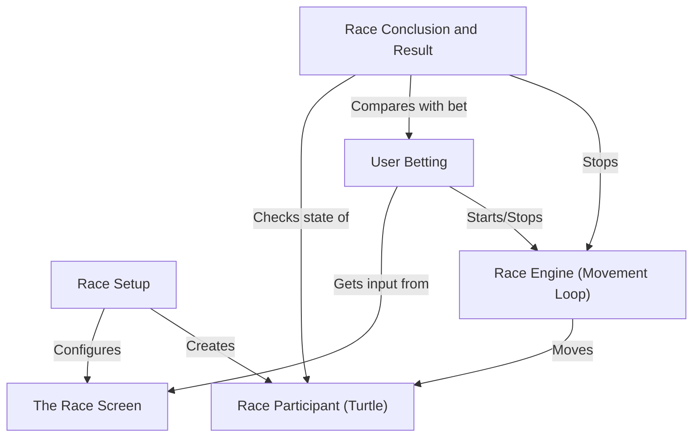

## Turtle Race

This project simulates a *simple turtle race* on a screen.
It **sets up** multiple turtles with different colors,
**asks the user** to bet on which color will win,
then **runs the race** by moving each turtle forward randomly.
Finally, it **announces the winner** and whether the user's bet was correct.

## Visual Overview

