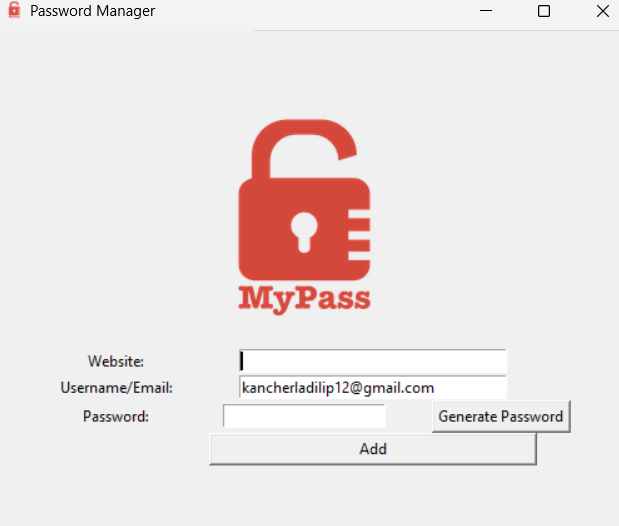

# Password Manager (Tkinter, Python)

A simple desktop Password Manager built with Python and Tkinter. It lets you:
- Generate strong random passwords
- Save website, email/username, and password entries to a local data.txt file
- Copy generated passwords to clipboard automatically
- Run as a standalone .exe on Windows (no Python required)

## Screenshots

## Prerequisites

### Option A: Use the prebuilt .exe (Windows)
- No prerequisites needed. Python is not required.

### Option B: Run from source
- Python 3.9+ installed
- pip installed

## Installation and Use

### Option A: Windows Executable
1. Download the ZIP release (password_manager.zip).
2. Extract the ZIP.
[password_manager.zip](dist/password_manager.zip)
3. Inside the extracted folder, double-click `password_manager.exe` to run.
4. A `data.txt` file will be created in the same folder when you save entries.

Notes:
- Some antivirus tools may flag unsigned executables. If that happens, allow/whitelist the app.
- Keep `password_manager.exe` and `data.txt` in the same folder so your saved entries remain accessible.

### Option B: Run from Source (Any OS)
1. Clone the repository:
 https://github.com/dilip9398/password-manager.git
2. (Optional but recommended) Create a virtual environment:
python -m venv .venv
.venv\Scripts\activate
3. Install dependencies:
4. Make sure these files are present in the project root:
- `password_manager.py`
- `icon.ico`
- `logo.png`
5. Run the app:
